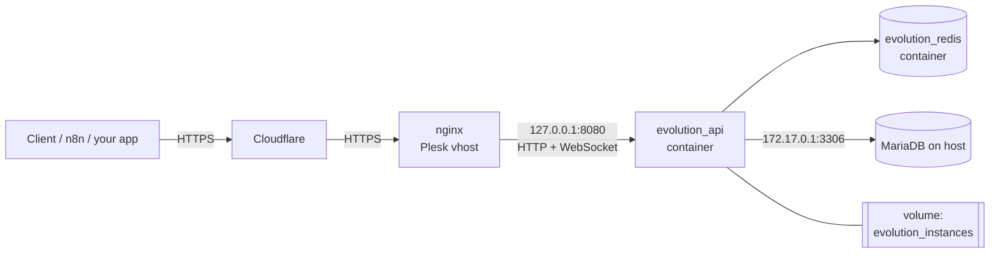

# whatsapp-api-selfhosted

**English** | [Türkçe](README.tr.md)

A production-tested deployment kit for running [Evolution API](https://github.com/EvolutionAPI/evolution-api)
(a WhatsApp REST API) on your own server with **Docker**, **MariaDB/MySQL**, **Redis** and **nginx**,
on a **Plesk**-managed Linux host behind **Cloudflare**.

It has been running in production for months without issues. Beyond the config files, this repo
documents the pitfalls you hit along the way and how to fix them. Most of those are
not covered in the official docs.

> This is not a fork of Evolution API and is not affiliated with it. Evolution API is developed by
> its own team under the Apache-2.0 license. This repo only contains deployment configuration
> and documentation.

## Architecture



- The API port is bound to `127.0.0.1` only. nginx is the single public entry point.
- MariaDB runs on the host, not in a container (Plesk manages it). The container reaches it
  over the `docker0` bridge. Port 3306 is **not** exposed to the internet.
- WhatsApp sessions live in the `evolution_instances` volume, so they survive container recreation and upgrades.

## Tested with

| Component       | Version                               |
|-----------------|---------------------------------------|
| OS              | Debian 12                             |
| Panel           | Plesk Obsidian 18.0                   |
| Evolution API   | `evoapicloud/evolution-api:v2.3.7`    |
| Database        | MariaDB 10.11 (Prisma `mysql` provider) |
| Cache           | Redis 7 (alpine)                      |

Plesk is optional. Any host with nginx works, and you can use the nginx snippets as-is.

## Repository layout

```text
.
├── docker-compose.yml             # API + Redis
├── .env.example                   # All settings, no secrets
├── nginx/
│   ├── vhost_nginx.conf           # Reverse proxy + WebSocket
│   └── vhost_nginx.branding.conf  # Same + optional white-labeling of the Manager UI
├── sql/mariadb-setup.sql          # Database + user
├── scripts/
│   ├── check-migrations.sh        # Detect missing MySQL schema changes
│   └── backup.sh                  # Back up sessions volume + database
├── branding/                      # Put your own logos here (none shipped)
└── docs/troubleshooting.md        # Pitfalls and fixes
```

## Installation

### 1. Database

Run `sql/mariadb-setup.sql` as root after changing the password:

```bash
mysql -u root -p < sql/mariadb-setup.sql
```

Let MariaDB listen on the Docker bridge as well as localhost. Edit the `[mysqld]` section of
`/etc/mysql/mariadb.conf.d/50-server.cnf`:

```ini
bind-address = 127.0.0.1,172.17.0.1
```

```bash
systemctl restart mariadb
ss -ltnp | grep 3306   # must show 127.0.0.1 and 172.17.0.1 only, never 0.0.0.0
```

> Multiple addresses in `bind-address` require MariaDB 10.11+ / MySQL 8.0.13+.

### 2. Application

```bash
mkdir -p /opt/evolution-api && cd /opt/evolution-api
# copy docker-compose.yml and .env.example here
cp .env.example .env
chmod 600 .env
openssl rand -hex 32          # use the output as AUTHENTICATION_API_KEY
nano .env                     # set SERVER_URL, API key, DB password
docker compose up -d
docker compose logs -f evolution-api
```

On first start Prisma runs the migrations and creates the tables.

### 3. Reverse proxy (Plesk)

1. Create the domain or subdomain (e.g. `whatsapp.example.com`) and issue a Let's Encrypt certificate.
2. **Apache & nginx Settings**: turn **off** "Proxy mode".
3. Paste `nginx/vhost_nginx.conf` into **Additional nginx directives** and save.

Without Plesk, put the same `location /` block inside your `server { }` block.

### 4. Verify

```bash
curl -s https://whatsapp.example.com/
# {"status":200,"message":"Welcome to the Evolution API...","version":"2.3.7",...,"whatsappWebVersion":"..."}
```

Then open `https://whatsapp.example.com/manager` and log in with your API key.

## Usage

Create an instance and fetch the QR code:

```bash
API=https://whatsapp.example.com
KEY=your-api-key

curl -s -X POST "$API/instance/create" \
  -H "apikey: $KEY" -H "Content-Type: application/json" \
  -d '{"instanceName":"main","integration":"WHATSAPP-BAILEYS","qrcode":true}'

curl -s "$API/instance/connect/main" -H "apikey: $KEY"
```

Send a text message:

```bash
curl -s -X POST "$API/message/sendText/main" \
  -H "apikey: $KEY" -H "Content-Type: application/json" \
  -d '{"number":"905xxxxxxxxx","text":"Hello from self-hosted Evolution API"}'
```

Full API reference: <https://doc.evolution-api.com>

## Operations

| Task                 | Command |
|----------------------|---------|
| Change API key / any `.env` value | edit `.env`, then `docker compose up -d --force-recreate evolution-api` (a plain `restart` does **not** re-read `.env`) |
| Upgrade              | change the image tag, then `docker compose pull && docker compose up -d`, then `./scripts/check-migrations.sh` |
| Logs                 | `docker compose logs -f --tail=200 evolution-api` |
| Backup               | `DB_PASS=... ./scripts/backup.sh /root/backups` (schedule it with cron or Plesk Scheduled Tasks) |

Changing the global API key does not affect existing instance sessions or instance tokens.

## Pitfalls (short version)

1. **`atendai/evolution-api` can no longer be pulled.** Use `evoapicloud/evolution-api`.
2. **MySQL migrations can lag behind PostgreSQL.** Missing columns block instance creation.
   Run `scripts/check-migrations.sh`.
3. **QR code never appears (`{"count":0}`).** The bundled Baileys version is rejected by WhatsApp. Upgrade the image.
4. **Cloudflare caches the Manager's JS/PNG.** Purge after nginx changes, or bypass the cache for this host.
5. **Serving an SVG on a `.png` path** needs an empty `types { }` block in nginx.

Details and fixes: [docs/troubleshooting.md](docs/troubleshooting.md)

## License

MIT for the files in this repository. Evolution API itself is licensed under Apache-2.0 by its authors.
