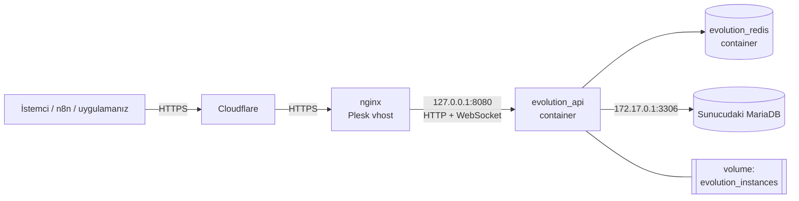

# whatsapp-api-selfhosted

[English](README.md) | **Türkçe**

[Evolution API](https://github.com/EvolutionAPI/evolution-api)'yi (WhatsApp REST API) kendi sunucunuzda
**Docker**, **MariaDB/MySQL**, **Redis** ve **nginx** ile çalıştırmak için production'da denenmiş
kurulum kiti. Ortam: **Plesk** yönetimli Linux sunucu, önünde **Cloudflare**.

Aylardır production'da sorunsuz çalışıyor. Repo yapılandırma dosyalarının yanında kurulum sırasında
karşılaşılan ve resmi dokümanda çoğu yer almayan tuzakları ve çözümlerini de içerir.

> Bu repo Evolution API'nin fork'u değildir ve onunla bir bağı yoktur. Evolution API, kendi ekibi
> tarafından Apache-2.0 lisansıyla geliştirilir. Burada yalnızca kurulum yapılandırması ve dokümantasyon bulunur.

## Mimari



- API portu yalnızca `127.0.0.1`'e bağlıdır. Dışarıya tek giriş noktası nginx'tir.
- MariaDB container'da değil, sunucunun kendisinde çalışır (Plesk yönetir). Container ona `docker0`
  köprüsü üzerinden bağlanır. 3306 internete **açık değildir**.
- WhatsApp oturumları `evolution_instances` volume'ünde tutulur. Container yeniden oluşturulsa ya da sürüm yükseltilse de kaybolmaz.

## Test edilen ortam

| Bileşen         | Sürüm                                 |
|-----------------|---------------------------------------|
| İşletim sistemi | Debian 12                             |
| Panel           | Plesk Obsidian 18.0                   |
| Evolution API   | `evoapicloud/evolution-api:v2.3.7`    |
| Veritabanı      | MariaDB 10.11 (Prisma `mysql` provider) |
| Cache           | Redis 7 (alpine)                      |

Plesk zorunlu değildir. nginx olan her sunucuda çalışır, nginx parçalarını olduğu gibi kullanabilirsiniz.

## Kurulum

### 1. Veritabanı

`sql/mariadb-setup.sql` içindeki şifreyi değiştirip root ile çalıştırın:

```bash
mysql -u root -p < sql/mariadb-setup.sql
```

MariaDB'nin localhost'a ek olarak Docker köprüsünde de dinlemesi gerekir.
`/etc/mysql/mariadb.conf.d/50-server.cnf` dosyasındaki `[mysqld]` bölümü:

```ini
bind-address = 127.0.0.1,172.17.0.1
```

```bash
systemctl restart mariadb
ss -ltnp | grep 3306   # yalnızca 127.0.0.1 ve 172.17.0.1 görünmeli, asla 0.0.0.0 değil
```

> `bind-address` içinde birden fazla adres MariaDB 10.11+ / MySQL 8.0.13+ gerektirir.

### 2. Uygulama

```bash
mkdir -p /opt/evolution-api && cd /opt/evolution-api
# docker-compose.yml ve .env.example dosyalarını buraya kopyalayın
cp .env.example .env
chmod 600 .env
openssl rand -hex 32          # çıktıyı AUTHENTICATION_API_KEY olarak kullanın
nano .env                     # SERVER_URL, API key, DB şifresi
docker compose up -d
docker compose logs -f evolution-api
```

İlk açılışta Prisma migration'ları çalıştırıp tabloları oluşturur.

### 3. Reverse proxy (Plesk)

1. Domain ya da subdomain'i (ör. `whatsapp.example.com`) oluşturup Let's Encrypt sertifikası alın.
2. **Apache & nginx Ayarları** sayfasında "Proxy modu"nu **kapatın**.
3. `nginx/vhost_nginx.conf` içeriğini **Ek nginx yönergeleri** alanına yapıştırıp kaydedin.

Plesk yoksa aynı `location /` bloğunu kendi `server { }` bloğunuzun içine koyun.

### 4. Doğrulama

```bash
curl -s https://whatsapp.example.com/
# {"status":200,"message":"Welcome to the Evolution API...","version":"2.3.7",...,"whatsappWebVersion":"..."}
```

Ardından `https://whatsapp.example.com/manager` adresini açıp API key ile giriş yapın.

## Kullanım

Instance oluşturup QR kodu alın:

```bash
API=https://whatsapp.example.com
KEY=api-keyiniz

curl -s -X POST "$API/instance/create" \
  -H "apikey: $KEY" -H "Content-Type: application/json" \
  -d '{"instanceName":"main","integration":"WHATSAPP-BAILEYS","qrcode":true}'

curl -s "$API/instance/connect/main" -H "apikey: $KEY"
```

Metin mesajı gönderin:

```bash
curl -s -X POST "$API/message/sendText/main" \
  -H "apikey: $KEY" -H "Content-Type: application/json" \
  -d '{"number":"905xxxxxxxxx","text":"Merhaba"}'
```

API referansı: <https://doc.evolution-api.com>

## Bakım

| İşlem               | Komut |
|---------------------|-------|
| API key / `.env` değişikliği | `.env` düzenlenir, ardından `docker compose up -d --force-recreate evolution-api` (salt `restart` `.env`'i **yeniden okumaz**) |
| Sürüm yükseltme     | image tag'i değiştirilir, ardından `docker compose pull && docker compose up -d`, sonra `./scripts/check-migrations.sh` |
| Loglar              | `docker compose logs -f --tail=200 evolution-api` |
| Yedek               | `DB_PASS=... ./scripts/backup.sh /root/backups` (Plesk Zamanlanmış Görevler ile planlayın) |

Global API key'i değiştirmek mevcut instance oturumlarını ve instance token'larını etkilemez.

## Tuzaklar (özet)

1. **`atendai/evolution-api` artık çekilemiyor.** `evoapicloud/evolution-api` kullanın.
2. **MySQL migration'ları PostgreSQL'in gerisinde kalabiliyor.** Eksik kolonlar instance oluşturmayı engeller.
   `scripts/check-migrations.sh` ile kontrol edin.
3. **QR kod gelmiyor (`{"count":0}`).** Eski Baileys sürümünü WhatsApp reddediyor. Image'ı yükseltin.
4. **Cloudflare Manager'ın JS/PNG dosyalarını cache'liyor.** nginx değişikliğinden sonra purge yapın ya da bu host için cache'i bypass edin.
5. **`.png` yolundan SVG servis etmek** için nginx'te boş bir `types { }` bloğu gerekir.

Ayrıntılar ve çözümler: [docs/sorun-giderme.md](docs/sorun-giderme.md)

## Lisans

Bu repodaki dosyalar MIT lisanslıdır. Evolution API ise sahipleri tarafından Apache-2.0 ile lisanslanmıştır.
